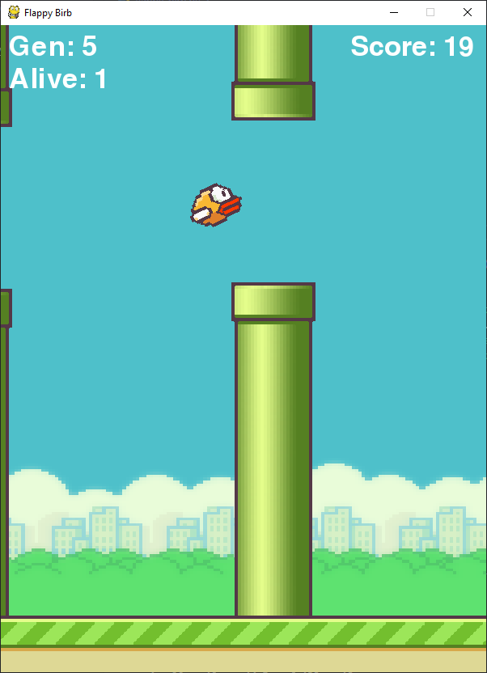

# AI learn to play Flappy Bird remake with NEAT and PyGame
<p align="center">
  <a href="https://github.com/aluizgc/flappy-bird-AI">
    
  </a>

## This repository contains a replica of the game Flappy Bird along with the implementation of NEAT.
## I didn't code this on my own, it was developed in a follow up tutorial of the channel [Tech With Tim](https://www.youtube.com/channel/UC4JX40jDee_tINbkjycV4Sg)

</p>
<p align="center">
  <a href="https://github.com/aluizgc/flappy-bird-AI">
    
  </a>
</p>

## Requeriments

- [Anaconda Distribution (Python 3.x Version)](https://www.anaconda.com/distribution/)

- Installing PyGame, NEAT and graphviz
```sh
pip install pygame
pip install neat-python
pip install graphviz
```
### Optional (IDE)
- [Visual Studio Code](https://code.visualstudio.com/)
## Extra content

- [NEAT Article](http://nn.cs.utexas.edu/downloads/papers/stanley.cec02.pdf)
- [NEAT Documentation](https://neat-python.readthedocs.io/en/latest/neat_overview.html)
- [PyGame Documentation](https://www.pygame.org/docs/)